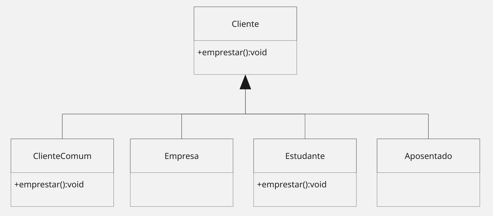

# Strategy Antipattern

O antipadrão do strategy se baseia em herança, ou seja, duplicação de código. Pois eu preciso alterar as classes e possivelmente a duplicação surge pela hereditariedade da classe pai.

